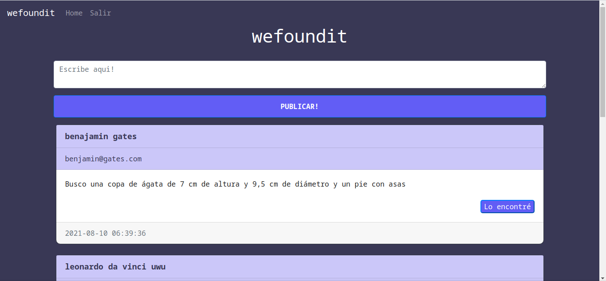
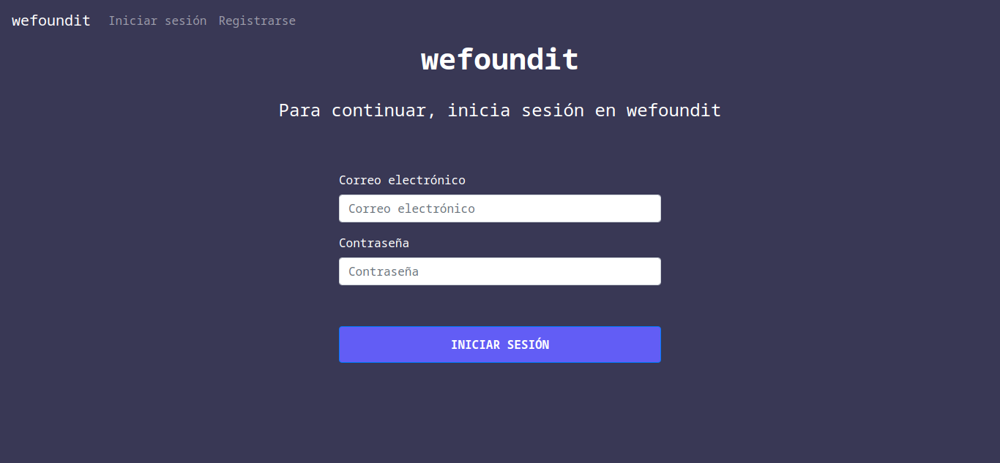
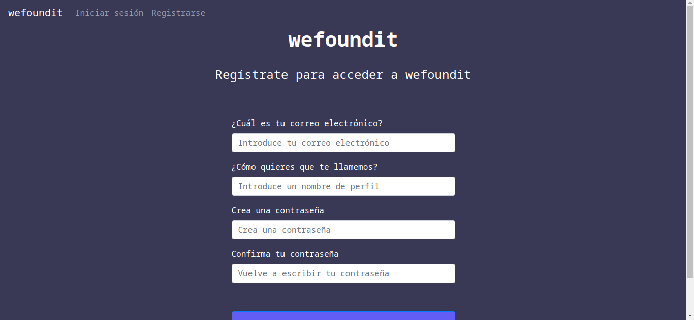

# Proyecto_final_dbp
## wefoundit
 wefoundit es un sitio web que permite a las personas publicar sobre objetos perdidos, este medio permite que otros usuarios puedan ayudar a encontrar dichos objetos.
 
 
 En esta web se puede:
 - Crear usuarios.
 - Logearse con una cuenta ya creada.
 - Publicar texto.
 
### Configuración e instalación


Asegúrese de tener instalado Python.

``` 
git clone https://github.com/ehsc/proyecto_final_dbp
```


``` 
pip install -r requisitos.txt
``` 
 
Para correr la app


``` 
python main.py
``` 


Par ver la App


 http://127.0.0.1:5000
 
 
 
 

## Interfaz grafica de usuario

Las tecnologías que se usaron fueron html, css, javascript y bootstrap.


 


 


- Para la interfaz se realizó un documento html de base, formulario de registro, inicio de sesion y el home (pagina principal).
- Con javascript se hizo un script para borrar las publicaciones (deleteNote) y otro para usar la libreria de SweetAlert para darle una pequeña animación al boton "Lo encontré"
- Un template de bootstrap permitió desarrollar la barra de navegación facilmente además de darle estilo a otros objetos.
- CSS se uso para darle estilo a la plantilla ya que era muy simple.
```
function deleteNote(noteId) {
    fetch("/delete-note", {
      method: "POST",
      body: JSON.stringify({ noteId: noteId }),
    }).then((_res) => {
      window.location.href = "/";
    });
  }
```
## Backend


Se hizo uso de Python y su framework Flask que permite usar un documento html com base para otros documentos html.


` Sign Upsign_up` 


` return render_template("login.html", user=current_user)` 

Las publicaciones solo pueden ser borradas por los autores de estas
```
           
            <button title="Eliminar nota" type="button" class="close" onclick="deleteNote({{ note.id }})">
                <span aria-hidden="true">&times;</span>
            </button>
            
```
## Base de Datos

Base de datos relacional.


SQLAlchemy para la base de datos que permite manipular las tablas de una base de datos como si fueran objetos de nuestro programa (ORM).
A continuación se muestran pasos que se usaron en el proyecto con pequeños ejemplos:


1. Definimos nuestro modelo.
```
class Note(db.Model):
    id = db.Column(db.Integer, primary_key=True)
    data = db.Column(db.String(10000))
    date = db.Column(db.DateTime(timezone=True), default=func.now())
    user_id = db.Column(db.Integer, db.ForeignKey('user.id'))
  ```
2. Insertamos en la base de datos
 ```
new_note = Note(data=note, user_id=current_user.id)
db.session.add(new_note)
db.session.commit()
 ```            
3. Buscamos con el id


`  note = Note.query.get(noteId)`  


4. Eliminamos un registro de la base de datos
```
 note.user_id == current_user.id:
 db.session.delete(note)
 db.session.commit()
```            
## Arquitectura de software
Con Flask se hizo uso del patrón MVC:

- Se uso una extensión de Flask para definir el modelo de datos.
- Con Flask vamos a definir un controlador, para determinar las rutas con las que accedemos a la aplicación, procesar la información requerida y mostrar la información necesaria.
- Flask utiliza jinja2, por lo que es muy fácil diseñar las vistas que vamos a mostrar a los usuarios en cada momento.


# Construido con


[Html](https://html.spec.whatwg.org/multipage/)


[Css](https://www.w3.org/Style/CSS/)


[Bootstrap](https://getbootstrap.com/)


[Javascript](https://developer.mozilla.org/es/docs/Web/JavaScript)


[Python](https://www.python.org/)


[Flask](https://palletsprojects.com/p/flask/)


[SqlAlchemy](https://www.sqlalchemy.org/)


